<html>
<body>

<h1> challenge_portfolio_IwonaJB</h1>

Moje portfolio na podstawie Dare IT challenge dla testerów manualnych.

<b>Spis treści
</b>
<h3>Task 1</h3>
<a href="#sub1">Task 1, Subtask 1 - wynik kartkówki z wiedzy teoretycznej</a> 
<a href="#sub3">Task 1, Subtask 3 - o mnie!</a> 
<a href="#sub4">Task 1, Subtask 4 - testy eksploracyjne aplikacji internetowej Scouts Panel</a> 
<a href="#fun">Funkcjonalności Scouts Panel</a> 
<a href="#zas">Funkcjonalności Scouts Panel - zastosowanie</a> 
<a href="#intu">Ocena intuicyjności Scouts Panel</a> 
<a href="#fejs">Ocena interfejsu Scouts Panel</a> 
<a href="#blad">Znalezione błędy Scouts Panel</a> 
<a href="#pt1">Pytania techniczne 1</a> 
<h3>Task 2</h3>
<a href="#2sub1">Task 2, Subtask 1 - przypadki testowe na podstawie User Story, aplikacja internetowa Scouts Panel</a> 
<a href="#2sub2">Task 2, Subtask 2 - przypadki testowe na podstawie własnych doświadczeń, aplikacja internetowa Scouts Panel</a> 
<a href="#2sub3">Task 2, Subtask 3 - po co pisać test case'y?</a> 
<a href="#2sub4">Task 2, Subtask 4 - przypadki testowe na podstawie własnych doświadczeń, aplikacja mobilna Pickeatup</a> 
<a href="#pt2">Pytania techniczne 2</a> 
<h3>Task 3</h3>
<a href="#3sub1">Task 3, Subtask 1 - formatka do zgłaszania błędów</a> 
<a href="#3sub2">Task 3, Subtask 2 - przeprowadzone testy i raporty błędów, aplikacja internetowa Scouts Panel</a> 
<a href="#3sub3">Task 3, Subtask 3 - raport z testów aplikacji internetowej Scouts Panel</a> 
<a href="#pt3">Pytania techniczne 3</a> 
<h3>Task 4</h3>
<a href="#4sub2">Task 4, Subtask 2 - raportowanie błędów aplikacji mobilnej OLX na podstawie testów eksploracyjnych</a> 
<a href="#4sub3">Task 4, Subtask 3 - aplikacja mobilna OLX z punktu widzenia użytkownika</a> 
<a href="#4sub4">Task 4, Subtask 4 - testy eksploracyjne aplikacji internetowej Swipeto i raportowanie błędów w Jira</a> 
<a href="#pt4">Pytania techniczne 4</a> 
<h3>Task 5</h3>
<a href="#5sub1">Task 5, Subtask 1 - opanowane operatory SQL</a> 
<a href="#5sub3">Task 5, Subtask 3 - opowiedzi na pytania przy wykorzystaniu SQL</a> 
<a href="#pt5">Pytania techniczne 5</a> 
<h3>Task 6</h3>
<a href="#6sub1">Task 6, Subtask 1 - opowiedzi na pytania przy wykorzystaniu SQL</a> 

<h1> TASK 1</h1>
<h2 id="sub1"> Subtask 1</h2>

10 punktów

<h2 id="sub3"> Subtask 3</h2>

Cześć! Nazywam się <b>Iwona</b>
, a odpowiedź na pytanie 

<blockquote cite="Pati">
Dlaczego zdecydował_ś się na udział w challenge portfolio?
</blockquote>

brzmi: <b>żeby zdobyć praktyczne doświadczenie i zostać testerką manualną na pełen etat!</b>

  Postanowiłam w końcu wykorzystać moje <i>naturalne predyspozycje</i>. Większość ludzi z mojego otoczenia skupia się na pozytywach, ja całe życie <b>poszukuję problemów lub potencjalnych niebezpieczeństw</b>. Postanowiłam, że pora już by mój charakter i przyszły zawód współgrały!

Mój cel?

<ul>
<li> zrealizowanie wszystkich zadań praktycznych,</li>
<li> zrealizowanie dodatkowych projektów,</li>
<li> zdobycie stażu,</li>
<li> zdobycie pracy jako Testerka Manualna.</li>
</ul>

Moje oczekiwania od QA Challenge?

<ul>
<li> praktyka, praktyka i jeszcze raz praktyka,</li>
<li> cenne rady od Mentorek,</li>
<li> opanowanie Jiry,</li>
<li> nauka dobrego planowania, przeprowadzania testów, opisywania błędów - pełen pakiet,</li>
<li> jeszcze więcej praktyki podczas testowania stron i aplikacji.</li>
</ul>

<h2 id="sub4">Subtask 4</h2>

Platforma <b>Futbol Kolektyw</b> pozwala na utworzenie profili zawodników, oznaczanie ich aktywności podczas rozegranych meczy, a w rezultacie w przejrzysty sposób ocenienie umiejętności gracza. Zgromadzone dane mogą pomóc łowcom talentów wyselekcjonować zawodników w których warto zainwestować.

<b>Funkcjonalności aplikacji:
</b>
<ul>
<li>logowanie,</li>
<li>wylogowanie,</li>
  <li>przypomnienie hasła,</li>
<li>dodanie gracza (karta danych),</li>
<li>edycja gracza,</li>
<li>utworzenie meczu,</li>
<li>aktualizacja meczu,</li>
<li>tworzenie raportu wizualnego (z oznaczeniem sytuacji na boisku),</li>
<li>edycja raportu wizualnego,</li>
<li>tworzenie raportu,</li>
<li>edycja raportu,</li>
<li>funkcje edytowania tekstu w raporcie (cofnij, powtórz, pogrubienie, pochylenie, podkreślenie, oznaczenie jako kod, dwa typy nagłówków, cytat, lista numeryczna, lista punktorów, rozmiar czcionki),</li>
<li>funkcja wyczyść,</li>
<li>aktywność (możliwość bezpośredniego przejścia do ostatnio tworzonych lub edytowanych danych),</li>
<li>linki pomocnicze,</li>
<li>wyszukiwanie,</li>
<li>sortowanie,</li>
<li>drukowanie,</li>
<li>pobranie pliku CSV,</li>
<li>zmiana języka,</li>
<li>zliczanie danych (ilości utworzonych graczy, meczy, raportów i akcji),</li>
<li>kontakt z teamem developerskim.</li>
</ul>

<b>Funkcjonalności - zastosowanie
</b>

Funkcjonalności <b>logowanie,wylogowanie</b>
służą do wejścia na platformę na konto użytkownika (logowanie) i wyjścia z platformy (wylogowanie).

Funkcjonalność <b>przypomnij hasło</b> służy do przesłania na zarejestrowany w bazie adres e-mail alternatywnego sposobu logowania w momencie gdy użytkownik zapomniał hasła.

Funkcjonalności <b>dodanie gracza, edycja gracza</b>
służą do założenia karty zawodnika (dodanie gracza) lub edycji tej karty (edycja gracza). W karcie danych zawodnika można zamieścić następujące informacje: e-mail, imię, nazwisko, telefon, waga, wzrost, data urodzenia, dominująca noga, klub, poziom rozgrywek, główna pozycja, pozycja alternatywna, wojewódźtwo, osiągnięcia, języki jakimi mówi zawodnik oraz linki do stron łączy nas piłka, 90 minut, profil facebook oraz linki do serwisu youtube.

Funkcjonalności <b>utworzenie meczu, aktualizacja meczu</b>
pozwalają na wprowadzenie informacji o nazwie drużyny zawodnika, nazwie drużyny przeciwnej, zdobytych golach, straconych golach, dacie spotkania, informacji czy był to mecz domowy czy wyjazdowy, kolorze koszulki, lidze, czasie gry, numerze na koszulce, informacji web match, informacji ogólnych (general) oraz recenzji. 
Dodatkowo do karty meczu pobrane zostają informacje dodane podczas tworzenia raportu wizualnego (lista zdarzeń).

Funkcjonalności <b>tworzenie raportu wizualnego, edycja raportu wizualnego</b>
umożliwia w czasie rzeczywistym dodawanie sytuacji które wydarzyły się na boisku, z zaznaczeniem miejsca w którym się wydarzyły. Po kliknięciu na odpowiednie miejsce boiska, gdzie doszło do zdarzenia, istnieje możliwość wyboru spośród 9 opcji: strzały, podania krótkie, podania długie, dośrodkowania, pojedynki 1 na 1, strata, faul, odbiór, inne. Po wybraniu odpowiedniego zdarzenia użytkownik ma możliwość doprecyzowania zdarzenia (poprzez zaznaczenie odpowiednich przycisków lub dodanei komentarza).

Funkcjonalności <b>tworzenie raportu, edycja raportu</b>
generuje raport w którym użytkownik ma możliwość dodania opisów poszczególnych sekcji takich jak: wstęp (system grania drużyn w meczu, czas gry poszczególnych zawodników), inteligencja boiskowa, mentalność i podsumowanie, oraz wystawienie ogólnej recenzji w postaci zaznaczenia ilości gwiazdek (na pięć możliwych, z dokładnością do pół gwiazdki). Dodatkowo raport składa się z zestawienia danych statystycznych wygenerowanych na podstawie raportu wizualnego, oraz możliwości dodania opisu zagrań niekonwencjonalnych.

Funkcjonalności <b>funkcje edytowania tekstu w raporcie</b>
pozwalają na wykorzystanie narzędzi edycji tekstu w miejscach przeznaczonych do edycji przez użytkownika. Są to funkcje: cofnij, powtórz, pogrubienie, pochylenie, podkreślenie, oznaczenie jako kod, dwa typy nagłówków, cytat, lista numeryczna, lista punktorów, rozmiar czcionki.

 Funkcja <b>wyczyść</b>
pozwala na usunięcie świeżo wprowadzonych w formularzu zmian.

Funkcjonalność <b>aktywność</b>
umożliwia łatwy dostęp (ze strony głównej) do ostatnio utworzonego gracza lub meczu oraz do ostatnio zaaktualizowanego gracza, meczu lub raportu poprzez przekierowanie do odpowiedniej karty gracza, meczu lub raportu.

Funkcja <b>linki pomocnicze</b>
pozwala na skorzystanie z przekierowania do często używanych stron (w tym przypadku do strony dodania nowego gracza do bazy)

Funkcja <b>wyszukiwania</b>
umożliwia przeszukanie wszystkich dostępnych danych na temat graczy w celu wykrycia danej frazy lub fragmentu frazy.

Funkcja <b>sortowanie</b>
umożliwia wybranie wyświetlenia w tabeli danych graczy. Użytkownik ma mozliwość wyboru: imienia, nazwiska, wieku, pozycji, klubu, recenzji, liczby meczów i liczby raportów.

Funkcja <b>drukowanie</b>
umożliwia wydruk obecnie widocznej listy graczy wraz z ich informacjami.

Funkcja <b>pobieranie pliku CSV</b>
pozwala na pobranie pliku o rozszerzeniu CSV.

Funkcja <b>zmiana języka</b>
pozwala na wybór języka platformy między językiem polskim i angielskim.

Funkcja <b>zliczanie danych</b>
pozwala użytkownikowi na szybki podgląd ilości zgromadzonych danych: ilości wprowadzonych graczy, meczy, raportów i akcji.

Funkcja <b>kontakt z teamem developerskim</b>
powoduje przejście na platformę komunikacyjną slack, na której możliwy jest kontakt z zespołem informatykó odpowiadających za utworzenie platformy.

<b>Ocena intuicyjności
</b>

Ogólną intuicyjność platformy oceniam dobrze. Strona główna jest przejrzysta i czytelna, wyświetlanie ostatnich aktywności uważam za bardzo pomocne. Umiejscowienie opcji dodania gracza na środku wyświetlanego ekranu uważam za dobrą decyzję z racji, iż jest to kluczowa funkcja dla platformy. Przyciski umożliwiające dodatkowe funkcje (np. drukowanie) są czytelne. W większości przypadków użytkownik nie będzie miał problemu z wybraniem odpowidniej ikony, ponieważ większość z nich po najechaniu kursorem wyświetli podpis dodatkowo wyjaśniający swoją funkcję. Niestety nie występuje to we wszystkich przypadkach.

Z punktu widzenia intuicyjności platformy proponuję następujące zmiany:

<ul>
<li>podczas tworzenia wizualnego raportu ikony widoczne nad boiskiem nie są w żaden sposób opisane (po najechaniu kursorem nie pokazuje się podpis funkcji) - dobrym pomysłem będzie dodanie podpisów by poprawić zrozumienie poszczególnych funkcji,</li>
<li>na stronie głównej w oknie aktywności nie wyświetla się informacja na temat ostatnio stworzonego raportu (jedynie informacja o ostatnio aktualizowanych raportach),</li>
<li>podczas sortowania wyświetlanych informacji o graczach nie ma znaczenia kolejność zaznaczanych i odznaczanych opcji - możliwość wyboru kolejności wyświetlanych danych w tabeli może okazać się przydatna,</li>
<li>brak możliwości ustawienia ilości wyświetlanych wyników w tabeli z danymi graczy (ustawione wyświetlanie 10 graczy, przydałaby się opcja wyboru),</li>
<li>po wejściu w zakładkę gracze (wyświetla się tabela z danymi graczy) brak przycisku <i>dodaj nowego gracza</i> - byłaby to przydatna funkcja, tym bardziej, że dodanie gracza możliwe jest tylko z zakładki <i>linki pomocnicze</i>,</li>
<li>podczas tworzenia i edycji raportu wizualnego nie ma możliwości przewijania czasu meczu - funkcja przewijania czasu może być bardzo przydatka podczas rozgrywek,</li>
<li>podczas tworzenia raportu wizualnego dobrze by było żeby punkty oznaczające zdarzenia pojawiały się w czasie (obecnie są wyświetlone od początku meczu bez względu na to w którym momencie doszło do zdarzenia),</li>
<li>w spisie meczy zawodnika nie ma rozdzielenia opisu ikony tworzenia raportu wizualnego na przed i po podjęciu działań - zarówno raport w którym nie zaznaczono działań na boisku, jak i raport który ma zaznaczone działania mają wyświetlaną tą samą ikonę po najechaniu na którą wyświetla się podpis <i>rozpocznij mecz</i> co jest dość mylące dla użytkownika,</li>
<li>brak możliwości wydrukowania raportu, dostępna jedynie opcja <i>zapisz</i> - raport wygląda na plik sformatowany do druku, szkoda pozbawiać użytkownika możliwości wydrukowania tak istotnego dokumentu,</li>
<li>brak pełnego zestawienia meczy i raportów, dostępne jedynie zestawienie graczy i następnie przegląd meczy i raportów konkretnego gracza - użytkownik nie zawsze musi pamiętać poszczególne nazwiska graczy, dostęp do pełnej bazy meczy czy raportów może ułatwić działania użytkownika na platformie,</li>
<li>brak możliwości segregowania danych np. wedle porządku alfabetycznego, po najlepszej ocenie, po ilości występów w meczach, czy chronologicznie - wprowadzenie tych funkcji może wpłynąć na komfort użytkowania platformy.</li>
</ul>

<b>Interfejs aplikacji
</b>

Interfejs platformy uważam za prosty i dobrze dopasowany do użytkownika. Platforma przeznaczona jest dla łowców talentów, którzy korzystają z niej podczas oceny pracy zawodnika - aby ocenić tą pracę muszą być obecni na meczu, albo oglądać jego transmisję. W takich warunkach nie są istotne walory wizualne platformy lecz jej prostota i jasne umiejscowienie niezbędnych funkcjonalności. W tym względzie platforma bardzo dobrze spełnia swoją rolę.

<b>Błędy znalezione na platformie Futbol Kolektyw
</b>

Przeprowadzone testy eksploracyjne pozwoliły na wykrycie następujących potencjalnych błędów:

<ul>
<li>możliwe jest stworzenie raportu, bez raportu wizualnego przez co w ostatecznych informacjach o meczu nie ma danych na temat statystyki (jedynie pola wypełnione podczas opisywania raportu),</li>
<li>istnieje możliwość pobrania tabeli CSV graczy jako plik Excel, ale niezbędna jest nad nią dodatkowa praca lub specjalny program do otwierania plików CSV (po otworzeniu pliku zapełnione 11 wersów, w większości słowem "object"),</li>
<li>na stronie logowania istnieje opcja logowania do platformy, ale nie ma opcji zarejestrowania (nasuwa się więc pytanie - w jaki sposób tworzone są konta przez użytkowników?) ,</li>
<li>pozycja gracza oraz pozycja alternatywna podczas tworzenia/edycji gracza - wskazane byłoby zastosowanie rozwijanej listy z wymienionymi pozycjami piłkarzy, możliwość wpisania może prowadzić do późniejszych problemów z wyszukiwaniem (np. jeśli użytkownik popełni literówkę),</li>
<li>podczas tworzenia raportu wizualnego nie ma opcji usunięcia ostatniej dodanej akcji (lub dowolnie wybranej) - kasuje się cały raport,</li>
<li>podczas dodawania meczu możliwe jest dodanie wartości strzelonych goli jako "-0" (minus zero) jednak wartość ta zostaje zmieniona podczas wyświetlania na poprawną (zero),</li>
<li>podczas dodawania/edycji danych gracza możliwe jest ustawienie ujemnych wartości wagi i wzrostu,</li>
<li>możliwe jest ustawienie daty urodzenia bardzo mocno wstecz (np. gracz mający 200 lat) lub w przyszłości (np. gracz który urodzi się za 50 lat) - wskazane jest zawężenie kalendarza,</li>
<li>brak ograniczenia możliwej liczby strzelonych goli podczas spotkania (możliwe dodawanie goli w miliardach),</li>
<li>w ustawieniach danych gracza podczas wyboru województwa z rozwijanej listy literówka "Dolnoślaskie" powinno być "Dolnośląskie",</li>
<li>opcja drukowania danych graczy nie umożliwia druku takiej tabeli jaka jest widoczna w aplikacji - dane graczy zostają rozbite, tak, że informacje o każdym z nich są przedstawione oddzielnie (możliwe drukowanie tylko danych graczy które są widoczne na ekranie),</li>
<li>możliwość dodawania emotikon w danych gracza w polach: "imię", "nazwisko", "telefon", "klub", "poziom rozgrywek", "główna pozycja", "pozycja alternatywna", "osiągnięcia", "języki", "Łączy nas piłka", "90 minut", "Facebook", "Youtube",</li>
<li>w momencie gdy w danych gracza wprowadzana jest wartość wiek lub wzrost i kursor nie zostanie kliknięty w inne pole tekstowe lub ogólny obszar aplikacji, użycie kółka myszy w celu przesunięcia w dół spowoduje przypadkowe zmniejszenie wartości przez użytkownika,</li>
<li>brak ograniczenia ilości wprowadzanych znaków w polach tekstowych (możliwość utworzenia ekstremalnie długich wpisów),</li>
<li>wprowadzenie ekstremalnie długich nazw (graczy, meczów lub raportów) powoduje, że ich nazwa nie jest w całości wyświetlana w oknie "Aktywność",</li>
<li>wprowadzenie ekstremalnie długich nazw (graczy, meczów lub raportów) powoduje, że tabele z danymi są rozciągane (tabela dopasowuje się do długości wpisanych danych, brak zawijania tekstu),</li>
<li>w formularzu dodawania/edycji meczu w oknie "Web match" powinna być dodatkowa informacja (i zabezpieczenie), że jest to miejsce do podania linku http z filmem z meczu - aktualnie istnieje możliwość wpisania tam dowolnych znaków (łącznie z emotikonami) które w ostatecznym raporcie pojawią się jako hiperłącze po kliknięciu w które pojawi się błąd 404 (nie znaleziono),</li>
<li>w panelu logowania przy ustawieniu języka jako polski, po wpisaniu błędnego hasła lub loginu komunikat o błędzie wyświetli się w języku angielskim,</li>
<li>podczas dodawania/edycji danych gracza w polu "E-mail" możliwe jest prowadzenie maili na domenie rządowej,</li>
<li>możliwość dodania emotikon podczas edycji danych meczu: "drużyna zawodnika", "drużyna przeciwna", "kolor koszulki", "liga", "general",</li>
<li>podczas przeglądania tablic z danymi graczy w DevTools pojawił się komunikat o przyszłym spodziewanym ograniczeniu informacji które otrzyma użytkownik w związku z występowaniem w skrypcie minimum jednego z oznaczeń: "navigator.userAgent", "navigator.appVersion" lub "navigator.platform" wraz z radą by zastąpić ich użycie lub przeprowadzić migrację danych na "navigator.userAgentData",</li>
<li>po zalogowaniu na stronie głównej przy ustawieniu języka polskiego kontakt z działem deweloperskim jest po angielsku - "DEV TEAM CONTACT",</li>
<li>podczas przeglądania tablic z danymi graczy w DevTools pojawia się komunikat o przestarzałych parametrach "start" i "limit",</li>
<li>podczas zapisywania raportu przy ustawieniu języka polskiego zamiast przycisku "zapisz" pojawia się przycisk "save",</li>
<li>podczas dodawania/edycji gracza nie ma informacji o wymaganym wprowadzeniu województwa, natomiast podczas tworzenia raportu jest ono wymagane (następuje propozycja edycji gracza),</li>
<li>podczas dodawania/edycji gracza w polu waga wprowadzenie wartości dziesiętnych (np.75,009) nie pozwala na dodanie gracza do bazy, jednak wymagane do zmiany pole nie jest zaznaczane w żaden sposób - użytkownik musi się domyślać które z pól należy zmienić,</li>
<li>brak zaznaczenia pola w którym wprowadzono błędną wartość w przypadku wprowadzania danych gracza w polu "E-mail",</li>
<li>brak ograniczenia wartości podczas dodawania/edycji gracza w polach "waga" i "wzrost",</li>
<li>podczas dodawania/edycji meczu przy ustawieniu języka angielskiego komunikat o błędnie wprowadzonej wartości strzałów wyświetla się w języku polskim,</li>
<li>podczas wyszukiwania graczy w bazie po wprowadzeniu wartości wieku minimalnego jako emotikony wyświetlają się wszyscy gracze,</li>
<li>możliwość wprowadzenia liczby Eulera (e) podczas dodawania/edycji graczy ale tylko pod warunkiem, że będzie się przed nią znajdowała inna liczba (może być ujemna) - lepsze byłoby ograniczenie się do liczb naturalnych,</li>
<li>podczas wyszukiwania w tabeli graczy możliwe ustawienie wieku również przy pomocy liczby Eulera - zbędne,</li>
<li>podczas wyszukiwania w tabeli graczy w pola "wiek" można dodać emotikony, mimo, że podczas dodawania karty gracza w tych polach nie jest to możliwe,</li>
<li>podczas przeglądu tabeli graczy w języku polskim ikony znajdujące się po prawej stronie (zapis pliku CSV, druk, sortowanie i wyszukiwanie) opisane są nadal w języku angielskim (po najechaniu kursorem na daną ikonę),</li>
<li>w oknie logowania po naciśnięciu przycisku "przypomnij hasło" w polu "E-mail" możliwe wpisanie dowolnych znaków (litery, numery, znaki specjalne, emotikony), a po naciśnięciu przycisku "wyślij" pojawia się komunikat "Wysłano wiadomość na podany adres e-mail.",</li>
<li>w oknie logowania po wpisaniu hasła przy użyciu DevTools możliwe jest zbadanie pola "hasło" i odczytanie wpisanego hasła w kodzie strony,</li>
<li>podczas testowania przy wolnym połączeniu ("Slow 3G") problemy z czasem połączenia (DevTools wyświetlają komunikat ERR:TIMED_OUT),</li>
<li>podczas dodawania/edycji gracza pola w które można podać linki http do odpowiednich serwisów (np. Youtube, Facebook) nie wykrywają gdy wpisze się w nie inne wartości (dowolne znaki) - wskazane jest dodać ograniczenie umożliwiające na dodawanie linków tylko z konkretnego oznaczonego serwisu.
</ul>

<h2 id="pt1">Pytania techniczne 1</h2>
<blockquote cite="Pati">
Co to są testy eksploratacyjne?
</blockquote>

Testy eksploracyjne jest to nieformalna technika testów, w której tester projektuje testy w rzeczywistym czasie wykonywania i wykorzystuje informacje zdobyte podczas testów do zaprojektowania nowych i lepszych testów.

<blockquote cite="Pati">
Co należy do zadań testera oprogramowania?
</blockquote>

Do zadań testera oprogramowania należy:
<ul>
<li>przegląd testów, uczestniczenie w opracowaniu testów,</li>
<li>analizowanie specyfikacji/historyjek użytkownika/norm,</li>
<li>identyfikowanie, dokumentowanie warunków testowych, powiązań między przypadkami testowymi,</li>
<li>projektowanie/weryfikowanie środowisk testowych,</li>
<li>projektowanie, implementowanie przypadków testowych,</li>
<li>pozyskiwanie danych testowych,</li>
<li>tworzenie harmonogramu wykonywania testów,</li>
<li>wykonywanie testów, ocenianie rezultatów, dokumentacja odchyleń,</li>
<li>korzystanie z narzędzi usprawniających proces testowy,</li>
<li>automatyzowanie testowania,</li>
<li>ewaluacja charakterystyk niefunkcjonalnych,</li>
<li>dokonywanie przeglądu testów opracowanych przez inne osoby.</li></ul>

<blockquote cite="Pati">
Kim jest tester oprogramowania?
</blockquote>

Tester oprgramowania jest to profesjonalista, wykwalifikowany w tematyce testowania oprogramowania, zaangażowany w testowanie modułu lub systemu.

<blockquote cite="Pati">
Czym są odpowiedzi z serwera HTTP?
</blockquote>

Odpowiedzi z serwera HTTP są to krótkie informacje na temat tego co się stało gdy serwer otrzymał żądanie wyświetlenia danej strony. 
Dzielą się na klasy:
<ul>
<li><b>100: kody informacyjne</b> - żądanie zainicjowane przez przeglądarkę jest kontynuowane,</li>
<li><b>200: kody powodzenia</b> - żądanie przeglądarki zostało pomyślnie odebrane, zrozumiane i przetworzone przez serwer,</li>
<li><b>300: kody przekierowań</b> - nowa zawartość została zastąpiona żądanym zasobem,</li>
<li><b>400: kody błędów klienta</b> - informacja o wystąpieniu problemu z żądaniem,</li>
<li><b>500: kody błędów serwera</b> - żądanie została zaakceptowane, jednak błąd na serwerze uniemożliwił jego spełnienie.</li></ul>

<h1>TASK 2</h1>
<h2 id="2sub1">Subtask 1</h2>

Poniżej link do folderu zawierającego przypadki testowe przygotowane dla Futbol Kolektyw na podstawie historyjek użytkownika.

<a href="https://docs.google.com/spreadsheets/d/1Ru3qecPZnvp0DMSxx0R5lsc-SRJ0GVErEJmRk2GvdG8/edit?usp=sharing/"> Task 2, Subtask 1</a>

<h2 id="2sub2">Subtask 2</h2>

Poniżej link do folderu zawierającego przypadki testowe przygotowane dla Futbol Kolektyw.

<a href="https://docs.google.com/spreadsheets/d/1nKjLz-g_rhwLrP2MOm4c9DqvHeCm1sPaUWxQ4Zz4WfA/edit?usp=sharing/"> Task 2, Subtask 2</a>

<h2 id="2sub3">Subtask 3</h2>

<b>Po co piszemy Test Case'y?
</b>

<b>Test Case'y (przypadki testowe)</b> piszemy, aby w możliwie najbardziej dokładny i przejrzysty sposób udokumentować różnorodne możliwości obsłużenia modułów danej aplikacji. Szczególnie istotne jest to przy projektach w których dany przypadek testowy wykonywany jest wielokrotnie. Dzięki wykorzystaniu przypadków testowych mamy możliwość upewnienia się, że nie pominęliśmy żadnej ważnej funkcjonalności, a także możemy na nich opierać raporty z wykonanych testów, natomiast dla nowych pracowników stanowią one doskonałe źródło wiedzy o produkcie.

<h2 id="2sub4">Subtask 4</h2>

Poniżej link do folderu zawierającego przypadki testowe przygotowane dla aplikacji Pick Eat Up.

<a href="https://docs.google.com/spreadsheets/d/1xP6OL_Vkr_Ni7DKIzA1aXGTAKYbaOh4yYyh0OSe_e8k/edit?usp=sharing/"> Task 2, Subtask 4</a>

<h2 id="pt2">Pytania techniczne 2</h2>
<blockquote cite="Pati">
Co to jest Przypadek Testowy?
</blockquote>

Przypadek testowy jest to zbiór danych wejściowych, wstępnych warunków wykonania, oczekiwanych rezultatów i końcowych warunków wykonania. 
Składa się z: 
<ul>
<li>unikalnego ID,</li>
<li>tytułu,</li>
<li>opisu,</li>
<li>wstępnych warunków uruchomienia,</li>
<li>kroków do wykonania testu,</li>
<li>oczekiwany rezultat,</li>
<li>kryteriów akceptacji,</li>
<li>warunków końcowych,</li>
<li>rezultatów poszczególnych kroków testowyc,</li>
<li>rezultatu testu</li></ul>

<blockquote cite="Pati">
Co to jest Test Plan?
</blockquote>

Dokument który określa zakres, metody, zasoby i harmonogram czynności testowych.

<blockquote cite="Pati">
Co to jest User Story?
</blockquote>

User Story (historyjka użytkownika) jest to wymaganie użytkownika (lub wymaganie biznesowe) opisujące funkcjonalność potrzebną użytkownikowi, kryteria niefunkcjonalne oraz kryteria akceptacji.

<h1>TASK 3</h1>
<h2 id="3sub1">Subtask 1</h2>

Poniżej znajduje się link do formatki do zgłaszania błędów, wraz z wypełnionymi zgłoszeniami błędów znalezionych podczas przeprowadzenia przypadków testowych.

<a href="https://docs.google.com/spreadsheets/d/1l087wncJWLLnWE_pqZog_4rNZVt_KRL3eU3lW4n8byA/edit?usp=sharing/"> Task 3, Subtask 1</a>

<h2 id="3sub2">Subtask 2</h2>

Poniżej znajduje się link do wcześniej utworzonych przypadków testowych, już po przeprowadzeniu testów.

<a href="https://docs.google.com/spreadsheets/d/1Ru3qecPZnvp0DMSxx0R5lsc-SRJ0GVErEJmRk2GvdG8/edit?usp=share_link/"> Task 3, Subtask 2 cz. 1</a>

<a href="https://docs.google.com/spreadsheets/d/1nKjLz-g_rhwLrP2MOm4c9DqvHeCm1sPaUWxQ4Zz4WfA/edit?usp=share_link/"> Task 3, Subtask 2 cz. 2</a>

<h2 id="3sub3">Subtask 3</h2>

Poniżej znajduje się link do raportu z przeprowadzonych testów.

<a href="https://docs.google.com/document/d/1WNEOv0CW_6bvpibhSyLCc06Yaz97DF9rhgn-2n_ft1I/edit?usp=sharing/"> Task 3, Subtask 3</a>

<h2 id="pt3">Pytania techniczne 3</h2>
<blockquote cite="Pati">
Co to jest błąd?
</blockquote>

Jest to działanie człowieka które powoduje powstanie nieprawidłowego rezultatu (innego niż oczekiwany, sprecyzowany w specyfikacji).

<blockquote cite="Pati">
Podaj elementy zgłoszenia błędu.
</blockquote>

Na zgłoszenie błędu składa się kilka istotnych części takich jak:
<ul>
<li>ID błędu,</li>
<li>Tytuł,</li>
<li>Środowisko,</li>
<li>Numer wersji (jeśli dotyczy np. aplikacji mobilnych),</li>
<li>Warunki wstępne,</li>
<li>Kroki do reprodukcji błędu,</li>
<li>Oczekiwane rezultaty,</li>
<li>Uzyskane rezultaty,</li>
<li>Data i czas wystąpienia błędu,</li>
<li>Priorytet,</li>
<li>Powaga błędu (Severity).</li></ul>

<blockquote cite="Pati">
Co to jest awaria?
</blockquote>

Awaria wynika z ciągu przyczynowo-skutkowego którego początkiem może być człowiek który popełni błąd. Konsekwencją błędu może być defekt który może pojawić się w oprogramowaniu. Po uruchomieniu oprogramowania z defektem może wystąpić awaria (nieprzewidziane zachowanie programu).

<h1>TASK 4</h1>
<h2 id="4sub2">Subtask 2</h2>

 Poniżej znajduje się link do formatki zgłaszania błędów aplikacji mobilnej OLX wraz ze zgłoszeniem błędów odnalezionych podczas testów eksploracyjnych.

<a href="https://docs.google.com/spreadsheets/d/1No__8kVkbKFYiFj8oYCdL2dfZMVTZBFDZUO_ZVbYZeo/edit?usp=share_link/"> Task 4, Subtask 2</a>

<h2 id="4sub3">Subtask 3</h2>
<blockquote cite="Pati">
Do czego służy ta aplikacja? Jaki jest cel tej aplikacji?
</blockquote>

Aplikacja służy do sprzedaży, wynajmu lub oddania za darmo rzeczy materialnych lub usług. Jej celem jest umożliwienie użytkownikowi wyszukanie przedmiotu poszukiwań również z uwzględnieniem lokalizacji, tak by użytkownik mógł umówić się na odbiór osobisty, obejrzenie przedmiotu, czy zaoferowanie usług na danym obszarze.

<blockquote cite="Pati">
Kto ma być użytkownikiem końcowym aplikacji?
</blockquote>

Użytkownikiem końcowym aplikacji są dwie grupy: oferujący i szukający/kupujący. Oferujący dzięki serwisowi mają możliwość zaofereowania swoich usług lub dóbr materialnych, szukający/kupujący mogą te rzeczy nabyć/obejrzeć i skontaktować się z oferującym.

<blockquote cite="Pati">
Czy według Ciebie aplikacja jest User friendly?
</blockquote>

W moim odczuciu aplikacja jest User friendly, jednak zdarzają się w niej pewnie niedogodności użytkowania które w moim odczuciu należy naprawić. Wygląd przycisków, filtry, podział na kategorie - to wszystko jest czytelne i umeiszczone w wygodnych miejscach. Możliwość przeglądania zdjęć przypisanych do oferty bez konieczności wchodzenia w ofertę jest bardzo przydatną i pożądaną funkcją. Niestety z przeglądaniem zdjęć wiążą się również problemy. Jednym z nich jest konieczność idealnego wstrzelenia się w długość przesuwania kciukiem zdjęcia - zbyt krótki ruch nie zmieni zdjęcia i może to powodować frustrację użytkownika. Natomiast po wejściu w ofertę i przeglądając tam zdjęcia (bez ich dodatkowego otwierania) kiedy użytkownik dojdzie do ostatniego zdjęcia i znów wykona ruch mający na celu zmianę zdjęcia nastąpi zmiana oferty. Sądzę, że niektórzy z użytkowników mogą nie zauważać zmiany, co może powodować zamieszanie i wprowadzać niejasności poprzez podejmowania decyzji o kupnie.

<blockquote cite="Pati">
Jak byś usprawnił aplikację? Co byś w niej poprawił? Czy masz pomysł na dodatkową funkcjonalność?
</blockquote>

Moim zdaniem naprawić należy zmianę zdjęć bezpośrednio w ofercie - po obejrzeniu ostatniego zdjęcia powinny wyświetlać się od początku, nie powinna następować zmiana oferty. Jeżeli chodzi o nową funkcjonalność to sądzę że pomocna byałby możliwość ustawiania zasięgu od ustawionego przez użytkownika miejsca lecz nie tylko jako promień wokół tego punktu. Wydaje mi się, że szczególnie podczas wyszukiwania nieruchomości bardzo przydałaby się funkcjonalność w której użytkownik mógłby zaznaczyć na mapie obszar który go interesuje oraz miejscowości które interesują użytkownika w pierwszej kolejności.

<blockquote cite="Pati">
Jakie dostrzegasz różnice między testowaniem aplikacji internetowej, a natywnej?
</blockquote>

Sądzę, że największą różnicą podczas testowania aplikacji internetowej i natywnej jest sposób przedstawienie informacji. W aplikacji natywnej produkt nastawiony jest na fakt, iż będzie użytkowany z telefonu komórkowego w związku z czym rozmieszczenie istotnych przycisków, wyświetlanie informacji czy wyszukiwanie musi być rozmieszczone w widocznych miejscach które umożliwią wygodną obsługę telefonu. W związku z tym aplikacja natywna skupia się na przedstawieniu paska menu z najważniejszymi opcjami w zakrsie wygodnego sięgania kciówków użytkowników, natmoast aplikacja internetowa ma na tym polu większą swobodę (obserwując aplikacje internetowe można stwierdzić, że menu najczęściej znajduje się na pasku górnym, lub z lewej strony ekranu).

<h2 id="4sub4">Subtask 4</h2>

 Przeprowadzono testy eksploracyjne aplikacji internetowej swipeto.pl. Poniżej przedstawione są zgłoszenia błędów zaraportowanych przy wykorzystaniu oprogramowania Jira.

<ol>
<li>
<b>BugID: DIT-3
</b></li>

<a href="https://drive.google.com/file/d/1lkbrPwVd183ZLqRdHtSFsbw-zLBq70-i/view?usp=share_link/"> Załącznik do błędu DIT-3</a>

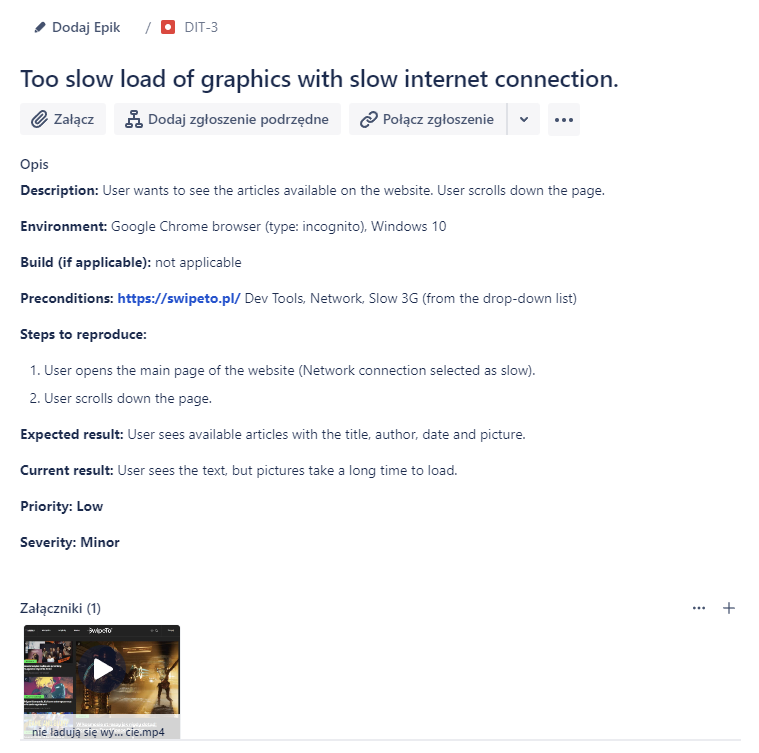

<li>
<b>BugID: DIT-4
</b></li>

<a href="https://drive.google.com/file/d/15H0ZqCSyGn34a3lnvone6ZrqxqRDzPUj/view?usp=share_link/"> Załącznik do błędu DIT-4</a>

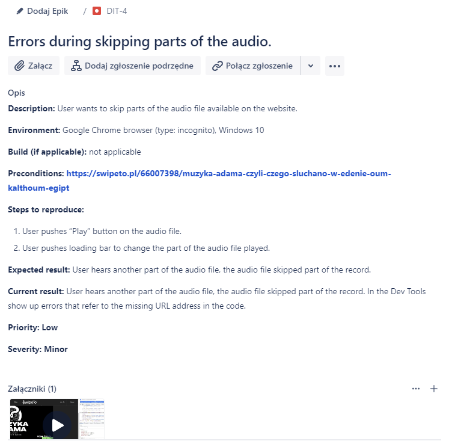

<li>
<b>BugID: DIT-5
</b></li>

<a href="https://drive.google.com/file/d/1ya_0lh76SWFwZq71fpnN1LRTAJowiNwq/view?usp=share_link/"> Załącznik do błędu DIT-5</a>

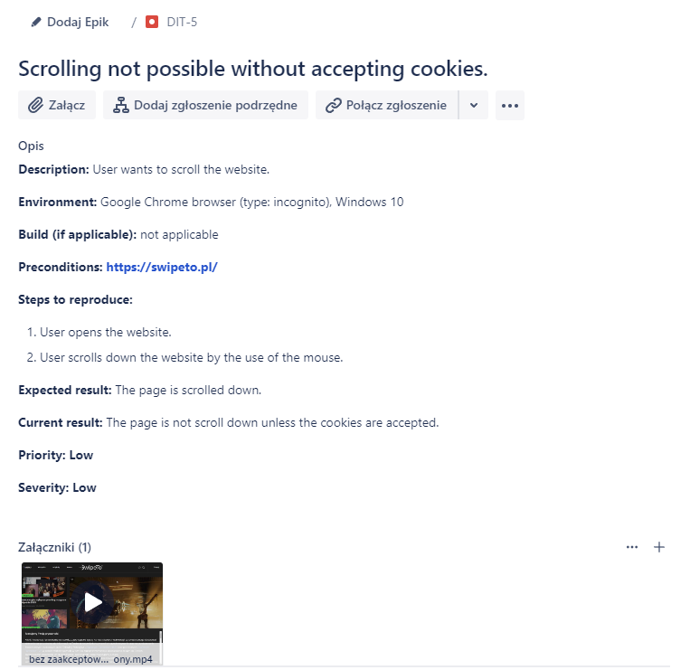

<li>
<b>BugID: DIT-6
</b></li>

<a href="https://drive.google.com/file/d/1cF1EbQD3XzGHiX9gZt1sftbjmIwXFzsc/view?usp=share_link/"> Załącznik do błędu DIT-6</a>

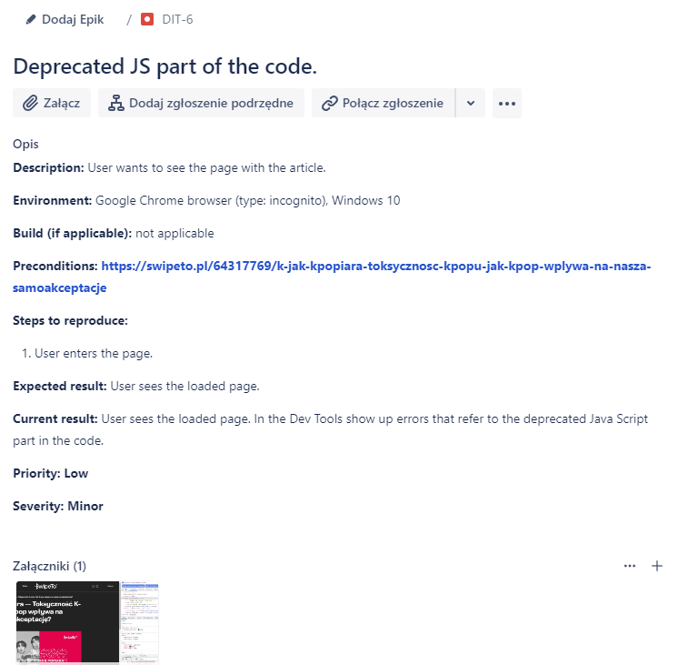

<li>
<b>BugID: DIT-7
</b></li>

<a href="https://drive.google.com/file/d/10jeYPtJ1FFP2-330r5M5pQh-P6etVMwH/view?usp=share_link/"> Załącznik do błędu DIT-7</a>

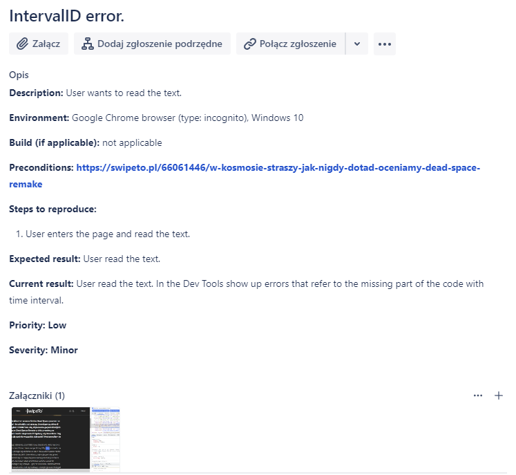

<li>
<b>BugID: DIT-8
</b></li>

<a href="https://drive.google.com/file/d/1yhvaExICpX1jf9lYDUah4pVaEJ2SrIN1/view?usp=share_link/"> Załącznik do błędu DIT-8</a>

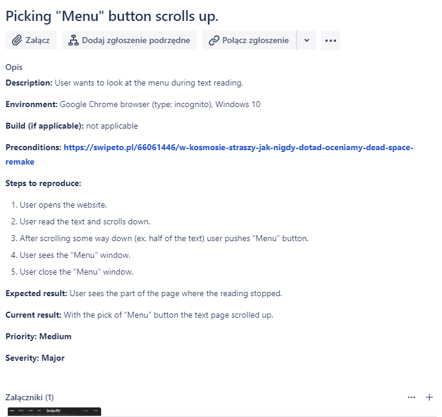

<li>
<b>BugID: DIT-9
</b></li>

<a href="https://drive.google.com/file/d/14OkLeuvFzxqJ_ykS_mVhSYYlft8lf1JD/view?usp=share_link/"> Załącznik nr 1 do błędu DIT-9</a>

<a href="https://drive.google.com/file/d/1LUx9FZ3qi7Iyrnoe70M3jeDD4kCzSq4W/view?usp=share_link/"> Załącznik nr 2 do błędu DIT-9</a>

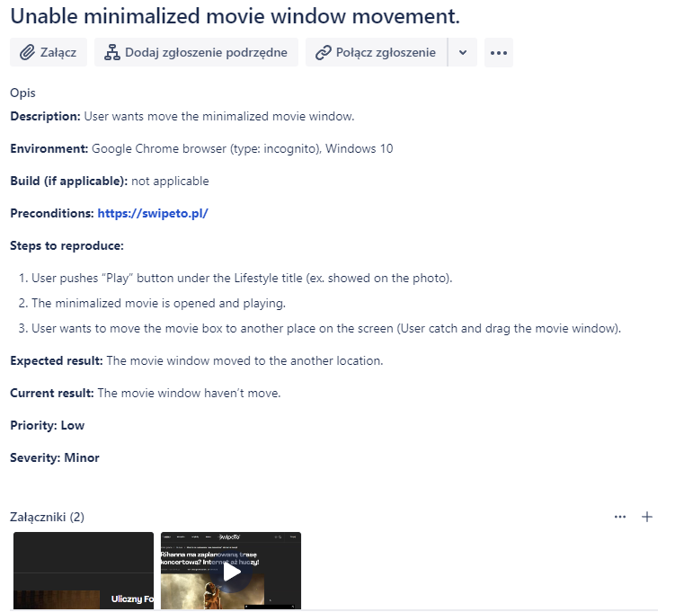

<li>
<b>BugID: DIT-10
</b></li>

<a href="https://drive.google.com/file/d/1FEusBFhvVeYtlHTtjNCDqvSElL8CLu2q/view?usp=share_link/"> Załącznik nr 1 do błędu DIT-10</a>

<a href="https://drive.google.com/file/d/1_9PCCfs9ye5S168MnsUkQDZl8ifN4W1t/view?usp=share_link/"> Załącznik nr 2 do błędu DIT-10</a>

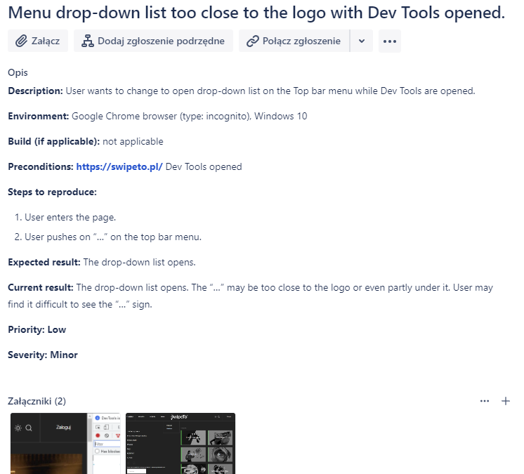

<li>
<b>BugID: DIT-11
</b></li>

<a href="https://drive.google.com/file/d/1GLSFInjznsuvSvlPzmlt3OI1jt5GiLUg/view?usp=share_link/"> Załącznik do błędu DIT-11</a>

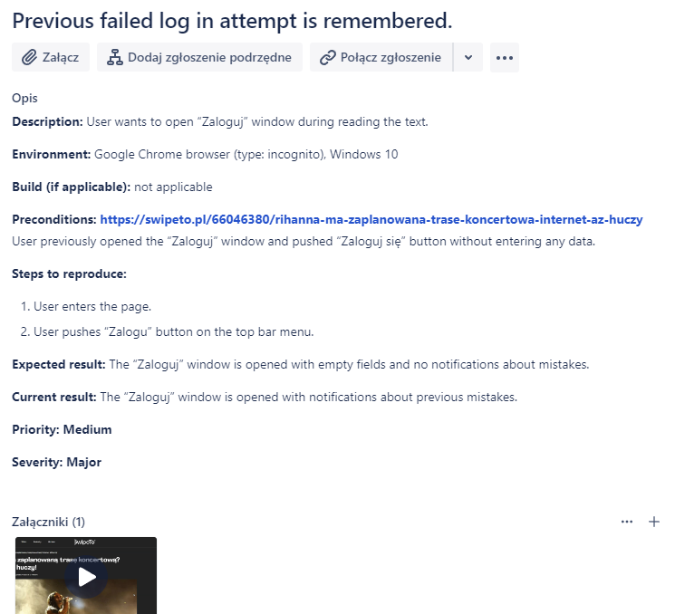
</ol>

<h2 id="pt4">Pytania techniczne 4</h2>
<blockquote cite="Pati">
Co to jest analiza wartości brzegowych?
</blockquote>

Jest to czarnoskrzynkowa technika projektowania przypadków testowych. Przypadki testowe projektowane są w oparciu o wartości brzegowe.

<blockquote cite="Pati">
Co to są klasy równoważności?
</blockquote>

Klasy równoważności są to podzbiory (grupy) danych wejściowych (lub wyjściowych), dla których zakłada się, że zachowanie modułu lub systemu jest takie samo.

<blockquote cite="Pati">
Co to jest testowanie czarnoskrzynkowe?
</blockquote>

Testowanie czarnoskrzynkowe polega na definiowaniu warunków testowych/przypadków testowych na podstawie analizy podstanowywch dokumentów opisujących atrybuty funkcjonalne lub/i niefunkcjonalne. Techniki czarnoskrzynkowe nieodwołują się do wewnętrznej struktury oprogramowania, czyli następuje analiza zewnętrznych interfejsów.

<blockquote cite="Pati">
Co to jest testowanie białoskrzynkowe?
</blockquote>

Testowanie białoskrzynkowe oparte jest na analizie wewnętrznej struktury komponentu lub systemu (oparte na informacjach o kodzie, architekturze systemu).

<h1>TASK 5</h1>
<h2 id="5sub1">Subtask 1</h2>

 Poniżej wymienione są operatory SQL z którymi się zapoznałam:
<ul>
<li>Select,</li>
<li>Select Distinct,</li>
<li>Where,</li>
<li>And, Or, Not,</li>
<li>Order By,</li>
<li>Insert Into,</li>
<li>Null Values,</li>
<li>Update,</li>
<li>Delete,</li>
<li>Select Top,</li>
<li>Min, Max,</li>
<li>Count, Avg, Sum,</li>
<li>Like,</li>
<li>Wildcard characters,</li>
<li>In,</li>
<li>Between,</li>
<li>Aliases,</li>
<li>Joins (Inner, Left, Right, Full).</li>
</ul>

<h2 id="5sub3">Subtask 3</h2>

Poniżej znajdują się moje odpowiedzi z wykorzystaniem SQL na pytania dotyczące otrzymanej bazy danych.

<ol>
<li><blockquote cite="Pati">
Wyświetl tabelę actors w kolejności alfabetycznej sortując po kolumnie surname.
</blockquote></li>

<b>SQL code:</b>select * from actors order by surname asc;

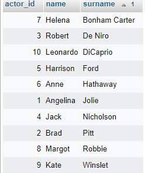

<li><blockquote cite="Pati">
Wyświetl film, który powstał w 2019 roku.
</blockquote></li>

<b>SQL code:</b>select * from movies where year_of_production='2019';

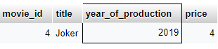

<li><blockquote cite="Pati">
Wyświetl wszystkie filmy, które powstały między 1900, a 1999 rokiem.
</blockquote></li>

<b>SQL code:</b>select * from movies where year_of_production between '1990' and '1999';

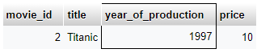

<li><blockquote cite="Pati">
Wyświetl JEDYNIE tytuł i cenę filmów, które kosztują poniżej 7$
</blockquote></li>

<b>SQL code:</b>select title, price from movies where price<7;

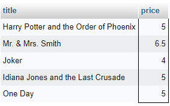

<li><blockquote cite="Pati">
Użyj operatora logicznego AND, aby wyświetlić aktorów o actor_id pomiędzy 4-7 (4 i 7 powinny się wyświetlać). NIE UŻYWAJ operatora BETWEEN.
</blockquote></li>

<b>SQL code:</b>select * from actors where actor_id >=4 and actor_id<=7;

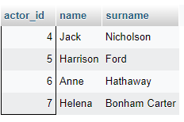

<li><blockquote cite="Pati">
Wyświetl klientów o id 2,4,6 wykorzystaj do tego warunek logiczny.
</blockquote></li>

<b>SQL code:</b>select * from customers where customer_id%2=0;

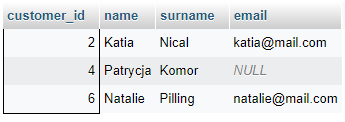

<li><blockquote cite="Pati">
Wyświetl klientów o id 1,3,5 wykorzystaj do tego operator IN.
</blockquote></li>

<b>SQL code:</b>select * from customers where customer_id in (1,3,5);

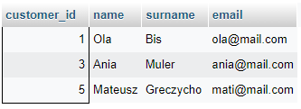

<li><blockquote cite="Pati">
Wyświetl dane wszystkich osób z tabeli ‘actors’, których imię zaczyna się od ciągu “An”.
</blockquote></li>

<b>SQL code:</b>select * from actors where name like 'An%';

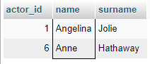

<li><blockquote cite="Pati">
Wyświetl dane klienta, który nie ma podanego adresu email.
</blockquote></li>

<b>SQL code:</b>select * from customers where email is null;

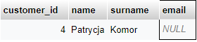

<li><blockquote cite="Pati">
Wyświetl wszystkie filmy, których cena wynosi powyżej 9$ oraz ich ID mieści się pomiędzy 2 i 8 movie_id.
</blockquote></li>

<b>SQL code:</b>select * from movies where price >9 and movie_id between 2 and 8;

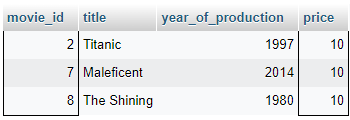
</ol>

<h2 id="pt5">Pytania techniczne 5</h2>
<blockquote cite="Pati">
Co to jest SQL?
</blockquote>

SQL jest to strukturalny język zapytań, służący do tworzenia i modyfikowania relacyjnych baz danych. Służy również do umieszczania i pobierania danych z baz danych.

<blockquote cite="Pati">
Co robi SELECT w zapytaniach SQLowych?
</blockquote>

SELECT służy do pobrania danych z bazy danych i przedstawieniu ich w postaci tabeli.

<blockquote cite="Pati">
Co robi * postawiona za SELECTem w zapytaniach SQLowych?
</blockquote>

Postawiona za SELECTem * służy do zaznaczenia, iż z wybranej bazy (np. bazy klientów) mają zostać wyświetlone wszystkie znajdujące się w niej tabele.

<a href="#6sub1">Task 6, Subtask 1 - opowiedzi na pytania przy wykorzystaniu SQL</a> 

<ol>
<li><blockquote cite="Pati">
Zastosuj funkcję dzięki której poprawisz błąd w nazwisku (zamiast Muler powinno być Miler).
</blockquote></li>

<b>SQL code:</b>update customers set surname='Miler' where customer_id='3';

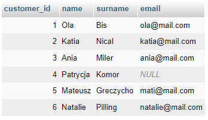

<li><blockquote cite="Pati">
Korzystając z funkcji JOIN sprawdź imię i maila klienta który który w ostatnim czasie kupił film o ID=4.
</blockquote></li>

<b>SQL code:</b>select customers.name, customers.email from (customers inner join sale on customers.customer_id=sale.customer_id) where sale.movie_id='4';

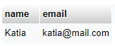

<li><blockquote cite="Pati">
Uzupełnij brak w bazie dodając mail klientki Patrycji.
</blockquote></li>

<b>SQL code:</b>update customers set email='pati@mail.com' where name='Patrycja';

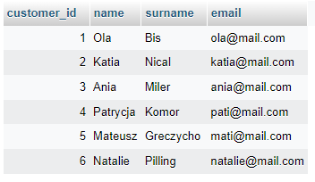

<li><blockquote cite="Pati">
Dla każdego zakupu wyświetl: imię i nazwisko klienta oraz tytuł kupionego filmu.
</blockquote></li>

<b>SQL code:</b>select sale.sale_date, customers.name, customers.surname, movies.title from ((sale inner join customers on sale.customer_id=customers.customer_id) inner join movies on movies.movie_id=sale.movie_id);

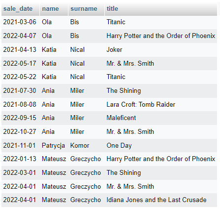

<li><blockquote cite="Pati">
W celu anonimizacji danych stwórz pseudonimy klientów. Dodaj kolumnę o nazwie 'pseudonim' oraz wypełnij w taki sposób by pseudonim stworzył się z dwóch pierwszych liter imienia i ostatniej litery nazwiska.
</blockquote></li>

<b>SQL code:</b>alter table customers add pseudonim CHAR(3); 
update customers set pseudonim=concat (left (name,2),right (name,1));

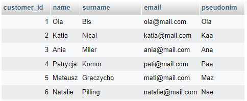

<li><blockquote cite="Pati">
Wyświetl tytuły filmów, które zostały zakupione w taki sposób aby tytuły się nie powtarzały.
</blockquote></li>

<b>SQL code:</b>select distinct title from movies;

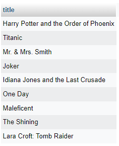
</ol>

<li><blockquote cite="Pati">
Wyświetl wspólną listę imion wszystkich aktorów i klientów, a wynik uporządkuj alfabetycznie.
</blockquote></li>

<b>SQL code:</b>select name from customers union select name from actors order by name ASC;

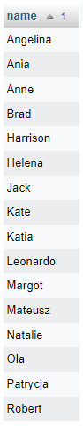

<li><blockquote cite="Pati">
Podnieś cenę wszystkich filmów o 2,5 $.
</blockquote></li>

<b>SQL code:</b>update movies set price=price+2.5;

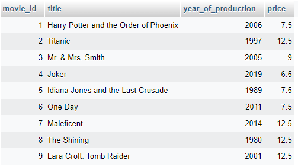

<li><blockquote cite="Pati">
Wyświetl imię i nazwisko aktora o ID=4 i tytuł filmu w którym zagrał.
</blockquote></li>

<b>SQL code:</b>select actors.name, actors.surname, movies.title from ((actors inner join cast on actors.actor_id=cast.actor_id) inner join movies on cast.movie_id=movies.movie_id);

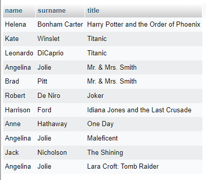

<li><blockquote cite="Pati">
Dodaj klientkę dołączając do tabeli dane: customer_id=7, name=Honia, surname=Stuczka-Kucharska, email=honia@mail.com i pseudonim=Hoa.
</blockquote></li>

<b>SQL code:</b>insert into customers values ('7','Honia','Stuczka-Kucharska','honia@mail.com','Hoa');

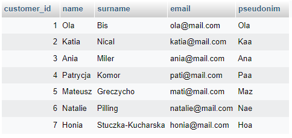

</body>
</html>
